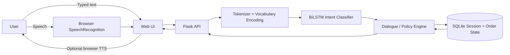

# ShopAssist

Voice-enabled shopping-support assistant built with Flask, PyTorch, SQLite, and browser speech APIs.

**Live application:** https://shopassist-dyrn.onrender.com/  
**Source code:** https://github.com/VaniVerma16/shopassist

ShopAssist accepts typed text or browser-transcribed English speech, classifies the request into one of 27 customer-support intents using a trained bidirectional LSTM, and executes controlled multi-turn order-support flows such as tracking, cancellation, returns, refund-status lookup, invoice retrieval, and shipping-address changes.

> The included orders and transactions are fictional. The application is an academic/project demonstration and does not connect to a real commerce backend.

## System architecture



The acoustic speech recognizer is provided by the browser. ShopAssist trains only the text intent classifier.

## Core features

- Voice input through `SpeechRecognition/webkitSpeechRecognition` with typed-chat fallback.
- 27-intent PyTorch BiLSTM classifier.
- Confidence, score-margin, and vocabulary-coverage rejection rules.
- Stateful multi-turn flows for missing order IDs, return reasons, new addresses, and confirmations.
- Session-isolated fictional order records stored in SQLite.
- Deterministic confirmation and transaction logic rather than free-form LLM actions.
- Idempotent request IDs for safe client retries.
- Flask API, Gunicorn production server, Docker packaging, and Render deployment.
- Automated functional tests plus a separate authored generalization challenge.

## Dataset

The intent classifier uses the **Bitext Customer Support 27K v11** dataset.

- Source rows: **26,872**
- Intent classes: **27**
- After normalized deduplication: **23,619**
- Removed duplicate rows: **3,253**
- Conflicting normalized labels: **0**
- Bitext split: **70% train / 15% validation / 15% test**, seed 42
- Original Bitext training examples after split: **16,533**
- Authored conversational supplement: **3,980**
- Final training records: **20,513**
- Validation records: **3,543**
- Test records: **3,543**

The Bitext data is synthetic/hybrid NLG data rather than real customer transcripts. `data/SOURCE.md` documents provenance, modifications, and licensing. The authored supplement is kept separate from the held-out Bitext validation and test text by normalized-overlap filtering.

## Model architecture

Input text is Unicode-normalized, lowercased, placeholder/number normalized, tokenized, mapped to a training-only vocabulary, and truncated to 40 tokens.

| Layer | Configuration |
|---|---|
| Input vocabulary | 995 tokens including padding/unknown |
| Embedding | 64 dimensions |
| Recurrent encoder | 1-layer bidirectional LSTM |
| Hidden width | 64 per direction |
| Sequence representation | Concatenated forward/backward final states, 128-D |
| Regularization | Dropout 0.30 |
| Dense layer | 128 -> 64 + ReLU |
| Regularization | Dropout 0.20 |
| Output | 64 -> 27 intent logits |
| Parameters | 140,251 |

Prediction uses softmax scores. A request is accepted only when the top probability is at least **0.55**, the top-two score margin is at least **0.15**, and at least **50%** of input tokens are known to the vocabulary.

## Training methodology

Training is reproducible on CPU.

- Optimizer: **AdamW**
- Learning rate: **0.002**
- Weight decay: **0.0001**
- Loss: **multiclass cross-entropy**
- Batch size: **128**
- Gradient clipping: **1.0**
- Random seed: **42**
- Training run: **10 epochs**
- Selected checkpoint: **epoch 7**, highest validation macro-F1
- Recorded CPU training time: **46.56 s** in the build environment

The vocabulary is fitted only on training data. Test-set metrics are computed after validation-based model and threshold selection.

## Results

Synthetic held-out results should be read together with the independently authored challenge because the source dataset contains templated/synthetic language.

| Evaluation | Result |
|---|---:|
| Synthetic held-out test accuracy | **99.13%** |
| Synthetic held-out macro-F1 | **0.9898** |
| Accepted synthetic-test coverage | **99.63%** |
| Accuracy among accepted synthetic-test predictions | **99.35%** |
| Authored challenge accuracy, n=40 | **60.0%** |
| Authored challenge coverage | **92.5%** |
| Unrelated inputs rejected | **12 / 20** |
| Median CPU inference on challenge | **1.08 ms** |
| Functional API/state tests | **17 / 17 passed** |

The large gap between the synthetic held-out score and the authored challenge is an important project result: the classifier performs very strongly on in-distribution Bitext-style text but generalizes less reliably to novel, short, or implicit phrasing. This is why the application uses rejection rules and deterministic dialogue handling instead of treating classifier confidence as infallible.

Speech word-error rate and true end-to-end voice latency have not been reported as measured results; they require testing on a real microphone/browser/device.

## Order-support flow

The classifier predicts the user's support intent. The dialogue engine then combines that intent with current session state and order records.

Supported transactional flows include:

- Track an order
- Cancel an eligible processing order
- Request a return for an eligible delivered order
- Check refund status
- Retrieve a plain-text receipt
- Change the shipping address of an unshipped order

Mutating actions are proposed first and require explicit confirmation. The system does not execute real payments, purchases, emails, pickup requests, or human-agent transfers.

## Repository layout

```text
shopassist/
├── app.py                     # Flask API and session persistence
├── engine.py                  # Dialogue-state and order-support policy
├── model.py                   # Tokenization, BiLSTM, inference
├── train.py                   # Reproducible training/evaluation
├── evaluate_challenge.py      # Authored generalization/OOD challenge
├── download_dataset.py
├── models/
│   ├── intent_bilstm.pt
│   └── metadata.json
├── data/
│   ├── bitext_intents.jsonl
│   ├── supplement.jsonl
│   ├── train.jsonl
│   ├── validation.jsonl
│   ├── test.jsonl
│   ├── SOURCE.md
│   └── LICENSE.txt
├── static/                    # Browser UI, speech recognition, TTS
├── tests/                     # Functional application tests
├── reports/                   # Metrics, predictions and project report
├── Dockerfile
├── render.yaml
├── requirements.txt
└── requirements-train.txt
```

## Run locally

Use Python 3.12.

### macOS / Linux

```bash
git clone https://github.com/VaniVerma16/shopassist.git
cd shopassist

python3.12 -m venv .venv
source .venv/bin/activate
python -m pip install --upgrade pip
python -m pip install -r requirements.txt
python app.py
```

### Windows PowerShell

```powershell
git clone https://github.com/VaniVerma16/shopassist.git
cd shopassist

py -3.12 -m venv .venv
.venv\Scripts\python -m pip install --upgrade pip
.venv\Scripts\python -m pip install -r requirements.txt
.venv\Scripts\python app.py
```

Open http://localhost:7860.

The trained checkpoint is already included, so retraining is not required to run the application.

## Reproduce training and evaluation

```bash
python -m pip install -r requirements-train.txt
python data/augment.py
python train.py
python evaluate_challenge.py
python -m unittest discover -s tests -v
```

Detailed measurements are stored in:

- `reports/metrics.json`
- `reports/challenge_results.json`
- `reports/test_predictions.jsonl`
- `reports/training_output.txt`

## API

| Endpoint | Method | Purpose |
|---|---|---|
| `/` | GET | Web interface |
| `/health` | GET | Deployment/model health |
| `/api/session` | GET | Current fictional order/session state |
| `/api/chat` | POST | Classify and process a support message |
| `/api/reset` | POST | Reset only the current browser session |
| `/api/invoice/<order_id>` | GET | Download fictional receipt |

## Deployment

The public application is deployed on Render using Docker and Gunicorn:

https://shopassist-dyrn.onrender.com/

The repository includes `Dockerfile` and `render.yaml`. Render is configured with `/health` as the health-check route, an automatically generated `SECRET_KEY`, secure cookies, and a disposable SQLite path under `/tmp`.

On a free Render service, cold starts can delay the first request and local SQLite data can be reset when the instance restarts.

## Privacy and limitations

- Audio is handled by the browser's speech-recognition provider; it is not sent to the Flask application as raw audio.
- Browser speech-recognition support varies by browser/device.
- There is no real user authentication or commerce backend.
- SQLite state is intentionally disposable for this project.
- The high synthetic test score should not be interpreted as real-world customer-support accuracy.
- The authored challenge demonstrates remaining weaknesses on unfamiliar phrasing and out-of-domain detection.

## Licensing

Application code is distributed under the repository's MIT `LICENSE`.

Bitext-derived data remains subject to the separate license and attribution included in `data/LICENSE.txt` and `data/SOURCE.md`.
